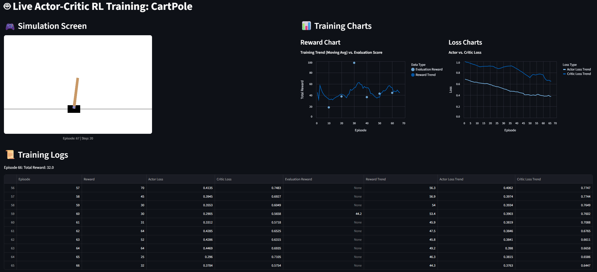

# Live Actor-Critic RL Training for CartPole

[](https://www.python.org/)
[](https://pytorch.org/)
[](https://streamlit.io/)
[](https://gymnasium.farama.org/)

This project is an interactive web application built with Streamlit that demonstrates a Reinforcement Learning agent learning to solve the classic `CartPole-v1` control problem from scratch. The entire training process, including the simulation, charts, and data, is updated live in the web interface.

---

## 🚀 Live Demo

You can access and run the live training session yourself by clicking the link below:

**[https://my-actor-critic-0.streamlit.app/](https://my-actor-critic-0.streamlit.app/)**

### Application Screenshot



---

## 🧠 How It Works: The Actor-Critic Brain

This project implements a simple Actor-Critic algorithm from scratch. Think of it as a **Player (Actor)** and a **Coach (Critic)** learning together.

*   **The Actor (Player):** Looks at the current state of the game (the pole's angle, cart's position, etc.) and decides on an action (push left or right). Its goal is to discover a "policy" that leads to higher scores.
*   **The Critic (Coach):** Also looks at the state of the game but doesn't play. Its only job is to *evaluate* how good that state is. It predicts the potential future score from that position.
*   **The Learning Moment:** The Actor takes an action. We see the real, immediate reward (+1 for surviving). The Critic compares this real outcome to its own prediction. The difference between expectation and reality (the "Advantage") is used as a learning signal to update both the Actor's and the Critic's neural networks.

### Understanding the Visualizations

The charts are the heart of this application, showing the agent's "thoughts" and progress.

#### Reward Chart
This chart shows how well the agent is performing over time.
*   **Training Trend (Blue Line):** This is a moving average of the agent's score in each episode during training. It shows the general learning trend.
*   **Evaluation Score (Light Blue Dots):** Every 10 episodes, the agent's "exploration" is turned off, and it plays 5 games using only what it thinks is the best strategy. This score represents the agent's true, stable performance.
*   **Bias-Variance Trade-off:** The gap between the noisy training trend and the stable evaluation score is a classic example of the Bias-Variance Trade-off. A large gap might indicate that the agent is getting lucky during training (high variance) and hasn't yet found a truly robust strategy.

#### Loss Charts
These charts show how much the Actor and Critic networks are changing their "minds" during training. A downward trend indicates that the networks are becoming more confident in their predictions and actions.

---

## 💻 Running the Project Locally

To run this application on your own machine, follow these steps:

1.  **Clone the repository:**
    ```bash
    git clone https://github.com/mturan33/my-actor-critic.git
    cd my-actor-critic
    ```

2.  **Create and activate a virtual environment:**
    ```bash
    python -m venv .venv
    # On Windows
    .venv\Scripts\activate
    # On macOS/Linux
    source .venv/bin/activate
    ```

3.  **Install the required packages:**
    ```bash
    pip install -r requirements.txt
    ```

4.  **Run the Streamlit application:**
    ```bash
    streamlit run app.py
    ```
A new tab should open in your web browser with the application running.
